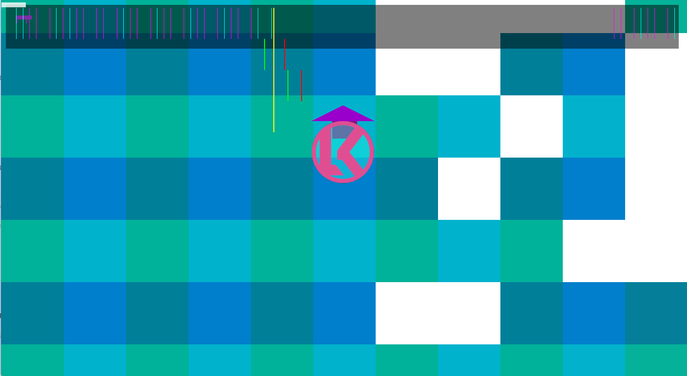

# Handmade Hero

My attempt at [Handmade Hero](https://guide.handmadehero.org/).

My focus is mostly implementing the various platform layers and not so much the game mechanics. 

## Cross Platform Satus

The Win32 Platform layer is is most advanced implemention.
Sound output, FPS Counter, Recording/Playpack and Hot Reload is supported.
The rendering is done via OpenGL.

For the MacOS platform layer Sound output is NOT yet implemented, neiter is Recording/Playback.
But Hot Reload is implemented and the rendering is done via Metal.

Linux/Wayland/X11 is not yet implemented.

## Preview

